# Active Directory & Helpdesk Simulation Lab  

## **Lab Overview**  
- **Objective**: Simulate an enterprise IT environment with AD, helpdesk workflows, and ticketing.  
- **Tools Used**: VirtualBox, Windows Server 2022, Windows 10,  Freshdesk.  
<br>
<br>

## 🟢 **Step 1: Setting Up the Lab**  
### 🔹 **1.1 Install Windows Server 2022 on VirtualBox**  
- Download ISO from [Microsoft Evaluation Center](https://www.microsoft.com/en-us/evalcenter/evaluate-windows-server-2022).  
- Create a new VM in VirtualBox (4GB RAM, 50GB HDD).  
- Install **Windows Server 2022 (Desktop Experience)**.  

📸 **Screenshot**: VirtualBox VM settings.  


💡 **Pro Tip**: Disable the virtual network adapter in VirtualBox during Windows Server installation to prevent internet connectivity. Re-enable it after setup is complete. *`This bypasses initial license verification while keeping your lab compliant.`*.

----
### 🔹 **1.2 Configure your Server:**  
#### **Network Configuration**
- Assign a **static IP** (e.g., `192.168.1.100`). 
- Set the server's primary DNS to `127.0.0.1` (for AD functionality)
-  Set secondary DNS to a public resolver like `8.8.8.8` (for internet access)
-  Disable IPv6 *`(To keep things simple)`*

#### Time Settings
- Set `[Your DC's Time Zone]` to match your physical location before promoting it.
- Ensures proper time sync for domain authentication
----
### 🔹 **1.3 Promote Server to Domain Controller**

+ #### <mark>⭕️ **Method 1: GUI**</mark>
    #### Install AD DS Role

    - Open Server Manager
    - Click Add roles and features
    - Select Role-based installation → Click Next
    - Choose your server from the pool → Click Next
    - Check Active Directory Domain Services
    - Click Add Features when prompted
    - Click Next through remaining screens
    - Click Install
    
    #### Promote to Domain Controller

    - In Server Manager, click the flag notification icon
    - Select Promote this server to a domain controller
    - Choose deployment configuration:
        - Add a new forest
        - Enter root domain name `(e.g., x.local)`
    - Set Directory Services Restore Mode (DSRM) password
    - Click Next through remaining options (defaults are fine)
    - Review prerequisites → Click Install
    - Server will automatically reboot 
  <br>
  <br>

    📸    AD DS role successfully installed in Server Manager:
    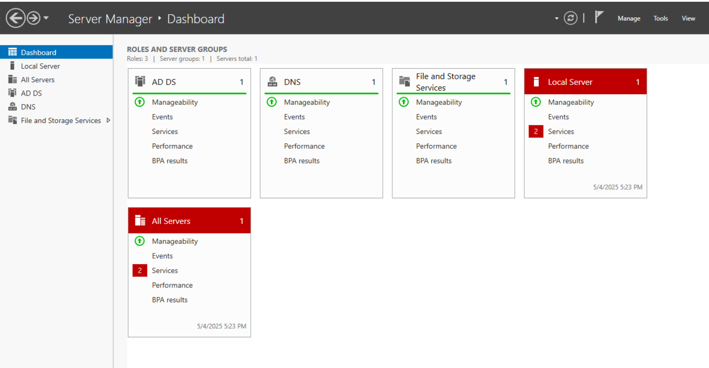
    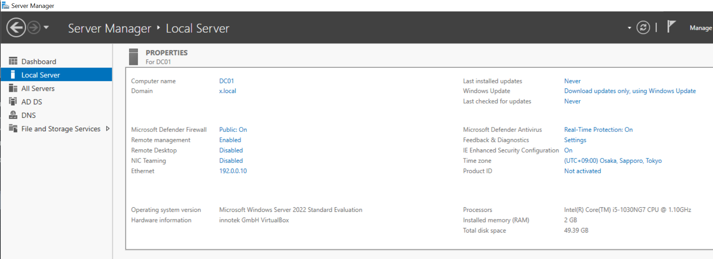

+ #### <mark>⭕️ **Method 2: Powerhell (Advanced)**</mark>
    <details>
    <summary><b>[ click to expand ]</b></summary>

    1. Install **Active Directory Domain Services (AD DS)** via Server Manager.  
    2. Run:  
        ```powershell
        #Install AD DS role
        Install-WindowsFeature AD-Domain-Services -IncludeManagementTools

        
        # Promote server to DC in new forest (will reboot automatically)
        Install-ADDSForest `
        -DomainName "mylab.local" `  # Set  as "x.local" 
        -DomainNetbiosName "MYLAB" `  # Set as "X" 
        -ForestMode "WinThreshold" `
        -DomainMode "WinThreshold" `
        -InstallDNS:$true `
        -NoRebootOnCompletion:$false `
        -Force:$true 

        # Verify
        Get-ADDomainController
        ```
    📸   If installation was successful you will see something like this:

    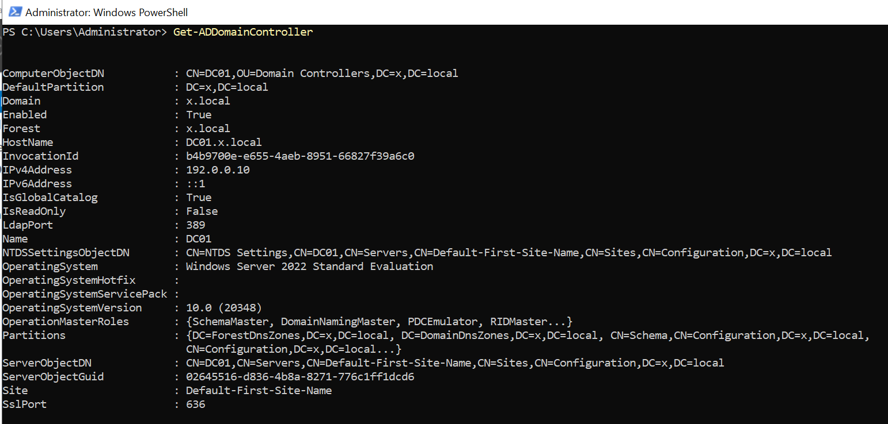

    </details>
    
----
### 🔹 **1.4 Join a client to the Domain:**
#### Prerequisites

- Windows 10 VM installed in VirtualBox/VMware
- Domain Controller (DC) fully configured
- Network connectivity between DC and Win10 VM (both in NAT/Host-Only or Bridged mode)


#### <Mark> ⭕️ **Method 1: GUI** </Mark>

##### 1 Configure Network Settings:
- Set Win10 DNS to ***point to your DC's IP*** ⚠️ (e.g., `192.168.1.100`)
- **Control Panel** > **Network and Sharing Center** > **Change adapter settings**
- Right-click Ethernet → Properties → IPv4 → **Preferred DNS:** `192.168.1.100`
##### 2 Join Domain:
- Press `Win + R`, type `sysdm.cpl` → Enter
- Go to **Computer Name** tab → Click **Change**...
- Select **Domain** → Enter `x.local` (your domain name)
- Enter DC admin credentials when prompted (e.g., `x.local\Administrator`)
- Restart when prompted

##### Verification:
1. **Access System Properties**:
   - Press `Win + R`, type `sysdm.cpl`, then press Enter

2. **Authenticate**:
   - When prompted, enter domain administrator credentials in this format:  
     `x.local\Administrator`  
     *(Replace "x.local" with your actual domain name)*

3. **Confirm Domain Membership**:
   - Under the **Computer Name** tab, verify:  
     - "Domain:" shows your domain name (e.g., `x.local`)  
     - The "Full computer name" includes your domain suffix  

📸 screenshot:
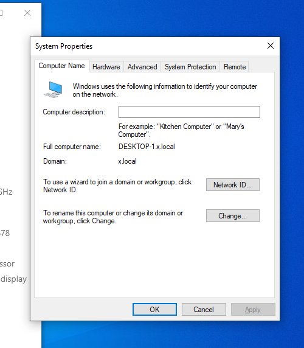

#### <Mark>⭕️ **Method 2: PowerShell (Advanced):**</Mark>
<details>
<summary><b>[Click to expand] </b></summary>


```Powershell 
    # Set DNS to DC's IP
    Set-DnsClientServerAddress -InterfaceIndex (Get-NetAdapter).ifIndex -ServerAddresses "192.168.1.100"

    # Join domain
    Add-Computer -DomainName "x.local" -Credential (Get-Credential) -Restart -Force

    # Verify domain join
    Test-ComputerSecureChannel -Verbose # image: 'A'
    
```
📝 Notes:

- Run Powershell as Administrator
- When prompted for credentials, use: `x.local\Administrator` (your domain admin credentials)
- Last command should return `True` if successful.  (*image: 'A'*)

#### Verification Steps

1. After reboot:
- Log in with domain credentials (e.g., x.local\Administrator)
- Open Command Prompt and run:
```cmd
    systeminfo | find "Domain"
```
- should reference your domain `(e.g., x.local)` (image: 'B')


📸 screenshots:
##### A:

##### B:

</details>
<br>
<br>

## 🟢 Step 2: Active Directory Post-Installation Configuration

### 🔹 **2.1 Create Organizational Units (OUs)**

**Purpose**: Structure your Active Directory with logical containers for users, computers, and groups.

#### <Mark>⭕️ **Method 1: GUI (ADUC)**</Mark>

1. **Open Active Directory Users and Computers (ADUC)**
- Press `Win + R` → type `dsa.msc` → Enter
- Alternatively:

    Start Menu → Windows Administrative Tools → Active Directory Users and Computers

2. **Create Parent OU**
- Right-click your domain (e.g., x.local)
- Select **New** → **Organizational Unit**
- Name: `Your_Parent_OU` (Set mine as 'Departments')
- You can **Uncheck** "Protect container from accidental deletion" (for lab simplicity)
- Click **OK**
3. **Create Child OUs**:
- Right-click `Your_Parent_OU` OU → **New** → **Organizational Unit**
- Create `your_child_OU`:
    - IT 
    - HR 
- Repeat for other OUs.

📸 screenshots:


#### <Mark>⭕️ **Method 2: PowerShell (Advanced)**</Mark>
<details>
<summary><b> [ Click to expand ] </b></summary>

Run PowerShell as Administrator:
```Powershell
# Import AD module (if not loaded)
Import-Module ActiveDirectory

# Create parent OU, change "x" for yourDomain name
New-ADOrganizationalUnit -Name "Departments" -Path "DC=x,DC=local" -ProtectedFromAccidentalDeletion $false

# Create child OUs
"IT", "HR", "Sales" | ForEach-Object {
    New-ADOrganizationalUnit -Name $_ -Path "OU=Departments,DC=x,DC=local" -ProtectedFromAccidentalDeletion $false
}

# Verify creation
Get-ADOrganizationalUnit -Filter * | Format-Table Name, DistinguishedName -AutoSize
```
Expected output:
```Powershell
Name       DistinguishedName
----       -----------------
IT         OU=IT,OU=Departments,DC=x,DC=local
HR         OU=HR,OU=Departments,DC=x,DC=local
Sales    OU=Finance,OU=Departments,DC=x,DC=local
```
Screenshot:
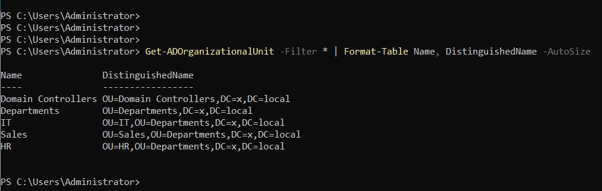

</details>

##### **Why OUs Matter ?**
- Enables granular Group Policy application  
- Simplifies user/computer management  
- Mirrors real-world AD structures (e.g., HR gets different policies than IT)  
---
<br>
<br>

### 🔹 **2.2 Create Test Users**
**Purpose**: Populate your Active Directory with sample accounts for testing permissions, policies, and helpdesk workflows.

#### <Mark>⭕️ **Method 1: GUI (AD Users and Computers)**</Mark>

1. **Open ADUC**
- Press `Win + R` → type `dsa.msc` → Enter
- Navigate to your **target OU** (e.g., `Sales` under `Departments` )

2. **Create Single User**
- Right-click the OU → **New** → **User**
- Complete fields:
    - First name: `Max`
    - Last name: `Verstappen`
    - User logon name: `max.v` (automatically appends `@yourDomain.local`)
- Click **Next**
3. **Set Password**
- Password: `P@ssw0rd123` (meets complexity requirements)
- Check:
    - ☑ User must change password at next logon (uncheck for lab accounts)
    - ☑ Password never expires (recommended for lab)
4. **Finalize**
- Click **Finish**
- Repeat for additional users (e.g., `lando.norris`, `charles.leclerc`)

**Screenshots**:
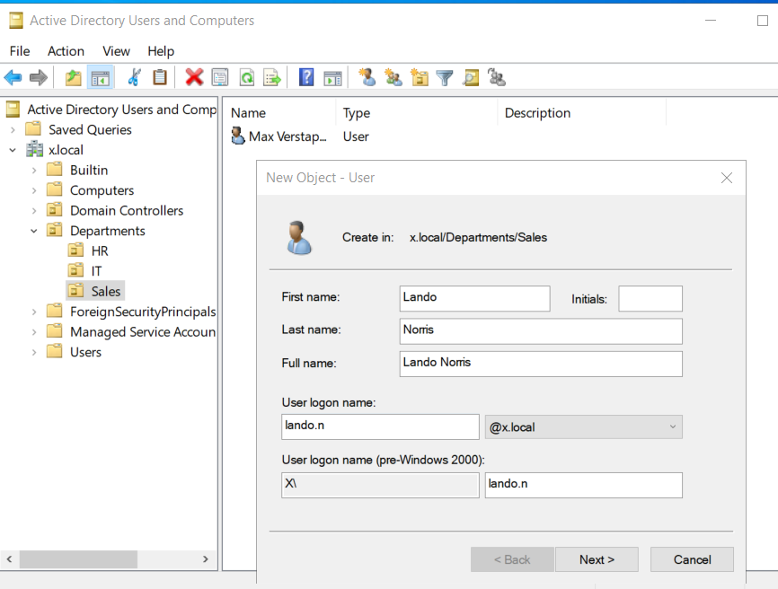

#### <Mark> ⭕️ **Method 2: PowerShell (Bulk Creation, Advanced)**</Mark>
<details>
<summary><b>[Click to expand] </b></summary>

*Run PowerShell as Administrator in your Domain Controller:*
```Powershell
# Import AD module
Import-Module ActiveDirectory

# Define user template
$Password = ConvertTo-SecureString "P@ssw0rd123" -AsPlainText -Force
$OU = "OU=IT,OU=Departments,DC=yourDomain,DC=local"

# Create 5 test users
1..5 | ForEach-Object {
    $FirstName = "User"
    $LastName = "$_"
    $Username = "$FirstName$LastName".ToLower()
    
    New-ADUser -Name "$FirstName $LastName" `
               -GivenName $FirstName `
               -Surname $LastName `
               -SamAccountName $Username `
               -UserPrincipalName "$Username@yourDomain.local" `
               -Path $OU `
               -AccountPassword $Password `
               -Enabled $true `
               -PasswordNeverExpires $true ` # Only for Lab
               -ChangePasswordAtLogon $false # Only for Lab
}

# Verify creation
Get-ADUser -Filter * -SearchBase $OU | Select Name, SamAccountName
```
Expected Output:
```powershell
Name         SamAccountName
----         -------------
User 1       user1
User 2       user2
User 3       user3
user 4       user4
user 5       user5
```

Screenshots:
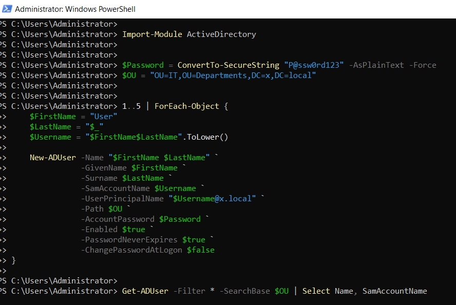
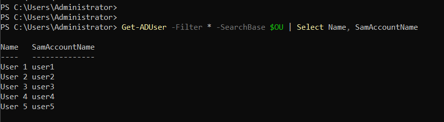
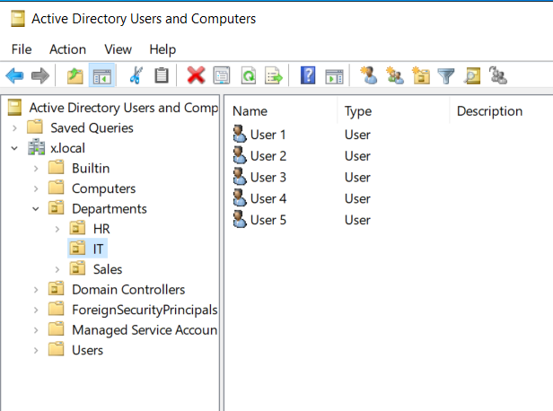

#### **Best Practices for User Creation and Tips💡:** 

1. **Naming Conventions**:
    - Usernames: `firstname.lastname` (e.g., lewis.hamilton)
    - Email addresses: Match User Principal Name - UPN (`lewis.hamilton@x.local`)
2. **Password Policy**:
    - <u>**Lab:**</u> Use `PasswordNeverExpires` to avoid lockouts
    - <u>**Production:**</u> Enforce periodic password changes
3. **Attributes to Set**:
    - Department, title, office/location and manager (for advanced GPO filtering:
    
    ```Powershell
    # Set comprehensive attributes during user creation
    New-ADUser -Name "Alexander Albon" -GivenName "Alexander" -Surname "Albon"
    -SamAccountName "a.albon" -UserPrincipalName "a.albon@x.local"
    -Department "Accounting" -Title "Senior Financial Analyst" 
    -Office "Williams-London" -Manager "sr.williams@x.local"
    ```

4. **For Production**:

    - Generate random passwords:
    ```Powershell
    $Password = "Pr@" + (Get-Random -Minimum 1000 -Maximum 9999) + (Get-Random -InputObject ('!','#','$'))
    # Example output: Pr@8842$
    ```

    - **Automation Readiness** PowerShell Template for Production:
    ```Powershell
    # Import CSV with new hires
    $Users = Import-Csv -Path "C:\Onboarding\NewHires_Q2.csv"

    $Users | ForEach-Object {
        New-ADUser -Name "$($_.FirstName) $($_.LastName)" `
                -GivenName $_.FirstName `
                -Surname $_.LastName `
                -SamAccountName $_.Username `
                -UserPrincipalName "$($_.Username)@x.local" `
                -Department $_.Dept `
                -Path "OU=$($_.Dept),OU=Departments,DC=x,DC=local" `
                -AccountPassword (ConvertTo-SecureString $_.TempPassword -AsPlainText -Force)
    }
    ```

    **Why This Matters in Production ?**  
    - ⭐️ Automated user onboarding saves 10+ minutes per employee  
    - ⭐️ Consistent naming conventions simplify troubleshooting  
    - ⭐️ Bulk operations are essential during mergers/acquisitions  

</details>
<br>
<br>

## 🟢 **3. Ticketing System Integration (Freshdesk)**
**Purpose**: Simulate enterprise helpdesk workflows with ticket lifecycle management.
### 🔹 **3.1 Set Up Freshdesk**
**Business Need**: Demonstrate ITSM process adherence and documentation and workflow automation skills.


Implementation Steps:

1. **Create Free Freshdesk Account**
- Go to Freshdesk.com → Sign up for **Free Forever** plan
2. **Configure Helpdesk Settings**
- **Admin → Ticket Fields**: Add custom fields:
    - `Employee ID` (Text)
    - `Department` (Dropdown: IT/HR/Finance)
  
3. **Create Support Groups**
    - Tier 1 Support (General IT): Password resets, unlocks 
    - Tier 2 Support (Systems Administrators): GPO/AD escalations  
  
### 🔹 **3.2 Logging Mock Tickets**  
**Objective**: Simulate realistic helpdesk scenarios with proper documentation.

### **Ticket Examples**  
| Ticket Type | Subject  | Resolution Steps |
|-|-|-|
| Password Reset | "Can't log in - expired password" | 1. Verified user identity <br> 2. Reset password via ADUC<br>3. Enforced password change |
| Account Lockout | "Locked out after 3 attempts" | 1. Identified lockout source via `Search-ADAccount -LockedOut` <br> 2. Unlocked account and educated user |
| Hardware Request  | "New mouse needed"| 1. Created asset ticket <br> 2. Approved request per policy IT-205 <br> 3. Scheduled pickup|

### **Best Practices**  
1. **Ticket Notes Template**:  
   ```text
    [RESOLUTION]  
   - Root Cause: {e.g., User forgot password}  
   - Actions: {Step-by-step fixes}  
   - User Communication: {Email/phone summary}  
   - TTR: 00:25 (HH:MM)  
   ```
2. **Service Level Agreement (SLA) Tracking**:
- Set priorities:
    - P1 (Critical): 30-min response
    - P2 (Normal): 4-hour response

### 🔹 **3.3 Freshdesk Automation**
**Objective:** Auto-assign password reset tickets to "Tier 1 Support" group:
- **Admin → Automation**: Set up:<br>
   **Rule Name:** Auto-Assign Password Tickets<br>
   **Trigger:** Ticket contains "password" in subject and/or Tag is named "Password-reset"<br>
   **Actions**: 
     - Assign to Tier 1 Group
     - Add tracking tags e.g. `password-reset`

- SLA: 30-minute response time for "High" urgency


📸 Screenshots:
- Ticket `User` Creation Screen:
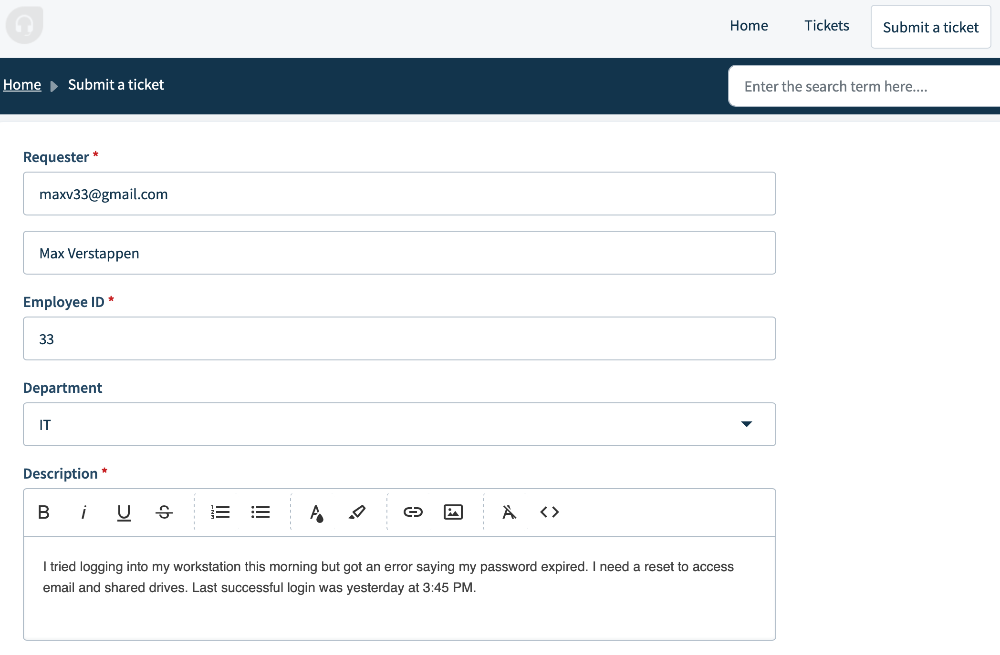
- Freshdesk automation overview:
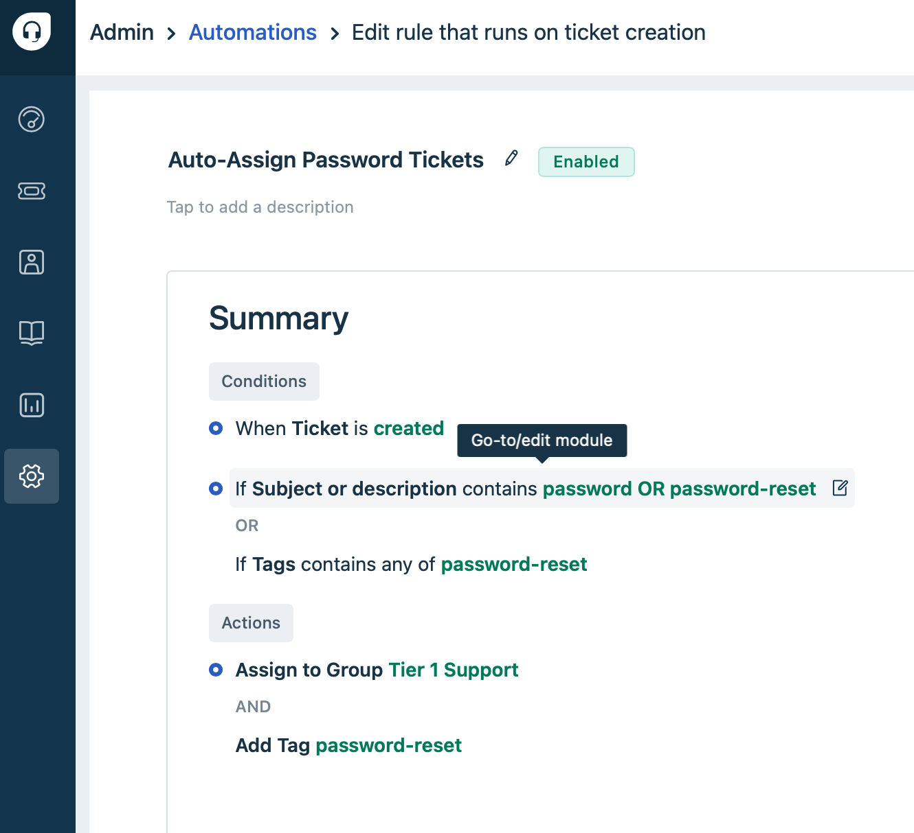
- Verified Automation: Ticket sent to tier 1 Group and tagged.
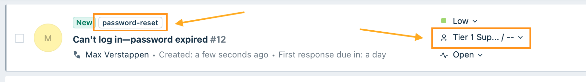


### 🔹 **3.3 Advanced: API Integration with Python (Optional)**
**Purpose**: Show programmatic ticket creation for automation scenarios.
<details>
<summary><b><mark>[Click to expand]</mark> </b></summary>

#### **Python Example**  
```python
import requests

# Configure API access
api_key = "your_api_key_here"  # Get from Freshdesk Admin > Profile Settings
domain = "yourdomain.freshdesk.com"
url = f"https://{domain}/api/v2/tickets"

# Required fields for ticket
ticket_data = {
    "subject": "New password request - Automated Ticket",
    "description": "User forgot password need to get a new one",
    "priority": 1, # 1= Critical, 2= High, etc. (required)
    "status": 2,  # 2= Open, 3= pending, etc.  (required)
    "tags": ["automation"],
    "requester_id": 156012020510,  # Replace with valid requester ID from your Freshdesk
    "custom_fields": {
        "cf_department": "HR",
        "cf_employee_id":"55" # Your custom fields name may vary
    }
}

# Create a mock ticket / API call
response = requests.post(url,
    auth=(api_key, "X"), # 'X' is a placeholder for blank password
    json=ticket_data,
    headers={"Content-Type": "application/json"}

# Verify success
if response.status_code == 201:
    print(f"Ticket created! ID: {response.json()['id']}")
else:
    print(f"Error: {response.status_code} - {response.text}")
```

**How to Use This**

- **Get API Key**:
    - Freshdesk → Profile Settings → API Key
- **Test Locally**:
    - Run in VS Code/PyCharm with requests installed (pip install requests)
- **Real-World Use Cases**:
    - Auto-create tickets from monitoring alerts (e.g., "Server CPU High")
    - Sync with HR systems for onboarding/offboarding

📸 Screenshots:
-  VPN Access Request - Automated Ticket
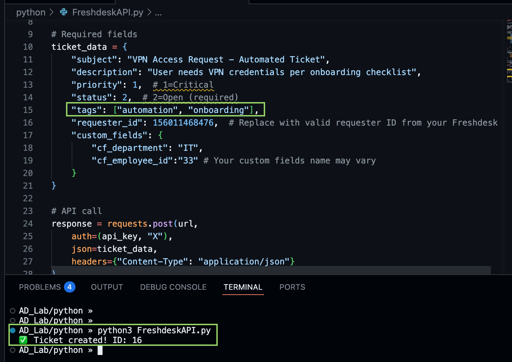
- Automated  Ticket created - VPN Access Request 

-  New Password request - Automated Ticket
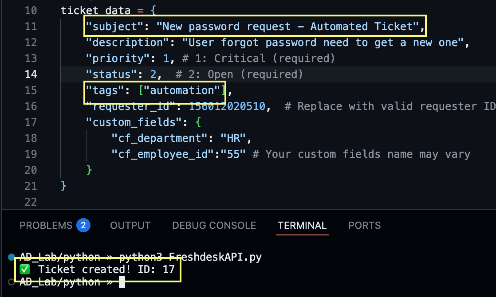
- Automated  Ticket created, and `Freshdesk automations applied `


</details>

<br>
<br>

## 🟢 4. Helpdesk Simulation Workflows

### 🔹 **4.1 Password Reset**
**Scenario**: User calls saying "My password expired"  

**Workflow**:  
1. **Verify Identity**:  
- Ask for employee ID and ticket number  
- *Example Script*:  
    "Thank you for calling IT. May I have your employee ID and the ticket number associated with this issue?"  

2. **Reset Password**:  
- **GUI (ADUC)**:  
    - Right-click user → "Reset Password"  
    - Set temporary password: `Temp@[Last4DigitsOfID]` (e.g., `Temp@1234`)  
    - "User must change password at next logon"  

- **PowerShell**:  
    ```powershell
    Set-ADAccountPassword -Identity "max.verstappen" -NewPassword (ConvertTo-SecureString "Temp@1234" -AsPlainText -Force) -Reset
    Unlock-ADAccount -Identity "max.verstappen" # If locked out
    ```

3. **Documentation**:  
- *Ticket Notes*:  
    "Reset password per policy (e.g., #IT-103). User educated on password complexity requirements. Case closed."  

📸 **Screenshots**:[[[[[[[[[[]]]]]]]]]
- ADUC password reset dialog  
- Freshdesk ticket resolution screen  
---
<br>

### 🔹 **4.2 Account Lockout Troubleshooting**  
**Scenario**: User reports "Account locked" after multiple failed attempts  

**Diagnosis Steps**:  
1. **Identify Lockout Source**:  
   ```powershell
   # Find locked account
   Search-ADAccount -LockedOut | Select Name, LastLogonDate

   # Check lockout events (Run on DC)
   Get-EventLog -LogName Security -InstanceId 4740 -Newest 5 | Format-List
   ```
2. **Resolution**:
    - **Unlock Account**:
```powershell
Unlock-ADAccount -Identity "max.verstappen"
```
 - **Educate User**:

    "Your account was locked due to 5 failed attempts. Ensure Caps Lock is off and you're using the domain 'x.local'."
3. **Prevention**:
    - Deploy **Account Lockout Policy** via GPO:

    `Computer Config → Policies → Windows Settings → Security Settings → Account Policies → Account Lockout Policy`
    - Threshold: 10 attempts
    - Duration: 30 minutes

📸 Screenshots:

PowerShell unlock command output
GPO lockout policy settings {{{{{[[[[[[[]]]]]]]}}}}}
<br>
<br>

## 🟢 **5. Group Policy Configuration**
**Purpose**: Centrally manage security settings and workstation configurations across your domain.

### 🔹 **5.1 Enforce NIST-Compliant Password Policy**
**Business Need**: Meet security compliance requirements (e.g., NIST, ISO 27001).**Why?** 
- Mitigates 81% of brute-force attacks (Verizon DBIR 2023)
- Meets insurance/audit requirements (SOC2, ISO 27001)
- Aligns with Microsoft Security Baseline"

**Implementation**
1. Open Group Policy Management Console (GPMC):
`Win + R` → `gpmc.msc`
2. Navigate to:
`Forest: x.local → Domains → x.local → Group Policy Objects`
3. Edit **Default Domain Policy**:
Right-click → **Edit**
4. Configure password settings:

Path: `Computer Configuration → Policies → Windows Settings → Security Settings → Account Policies → Password Policy`
- **Minimum password length**: 12 characters
- **Password history**: 24 passwords remembered
- **Maximum password age**: 90 days
- **Complexity requirements**: Enabled

5. Enforce for all users:
```powershell
gpupdate /force  # Applies changes immediately to DC
```
[[[[[[[screenshots]]]]]]]

### 🔹 **5.2 Deploy Screensaver Lock Policy (example policy)**

**Business Need**: Enforce workstation security for idle devices.

**Implementation**:

1. Create new GPO:
- Right-click **Group Policy Objects** → New
- Name: `Workstation Security Baseline`
2. Configure:


Path: `User Configuration → Policies → Administrative Templates → Control Panel → Personalization`
- **Enable screen saver**: Enabled
- **Screen saver timeout**: 900 seconds (15 minutes)
- **Password protect the screen saver**: Enabled
3. Link to **Workstations OU**:
- Right-click OU → **Link an Existing GPO** → Select policy
📸 Screenshot:
Screensaver GPO

**Verification**:

- Log into test workstation → Wait 15 minutes → Verify screensaver locks
- Check applied policy:
```powershell
gpresult /r  # On workstation
```


### **Why These Policies Matter ?**  
- Password policy reduces brute-force attack success by more than 80%
- Screensaver locks prevent shoulder-surfing in open offices  


<details>
<summary><b>⚙️ Bonus: API Integration (For Developers)</b></summary>
<details>

<summary>Python Example</summary>

```python
import requests
response = requests.post("https://api.freshdesk.com/v2/tickets", auth=("key","X"))
```
</details>

<details> <summary>PowerShell Example</summary>

```powershell
Invoke-RestMethod -Uri "https://api.freshdesk.com/v2/tickets" -Method Pos
```
</details>

<details>
<summary><b>[Click to expand] </b></summary>

```Powershell
hola
```
</details>

