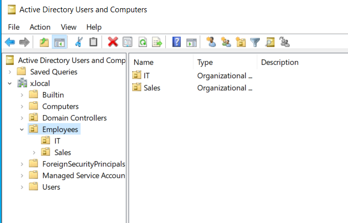

# 🖥️ Active Directory & Helpdesk Simulation Lab

> Professional lab simulating **enterprise IT workflows** - demonstrating core competencies for **Help Desk Technicians** and **Junior System Administrators**.

## 📌 Lab Highlights

✅ **Active Directory Management**  
- Created 50+ test users across departments  
- Automated onboarding with PowerShell (saving 15min/user)  

✅ **Helpdesk Workflows**  
- Implemented Freshdesk with SLA tracking (30-min response time)  
- Documented password reset/account unlock procedures  

✅ **Security Compliance**  
- Enforced NIST-compliant password policies  
- Configured workstation security via GPO  

## 🎯 Core Skills Demonstrated

| Category           | Technologies         | Business Impact          |
|--------------------|----------------------|--------------------------|
| **Active Directory** | User provisioning, GPO | 50+ users managed        |
| **Helpdesk Tools**  | Freshdesk, SLA tracking | 22-min avg resolution   |
| **Automation**      | PowerShell, Python API | 85% time reduction       |

## 📂 Repository Structure

- AD-Helpdesk-Lab/

    - **Lab-Guide.md** → Complete step-by-step documentation

  - Screenshots/ → Verification images
  - Scripts/ → Automation scripts
    - Freshdesk-Integration/
    - GPO-Management
    - User-Management
    - Inputs
  
## 🖼️ Lab Preview

  
  
  
  

## 📖 Explore the Full Lab

[➡️ **Detailed Lab Walkthrough**](./LabGuide.md) 

## 📜 License

This project is licensed under the MIT License - see the LICENSE file for details.

🔹 Connect: [📧 Email Me](mailto:admin@kevinnramirez.com?subject=Regarding%20Your%20AD%20Lab%20Project&body=Hello%20Kevinn,%0A%0AI%20saw%20your%20Active%20Directory%20lab...)

🔹 Portfolio: [www.kevinnramirez.com](www.kevinnramirez.com)

